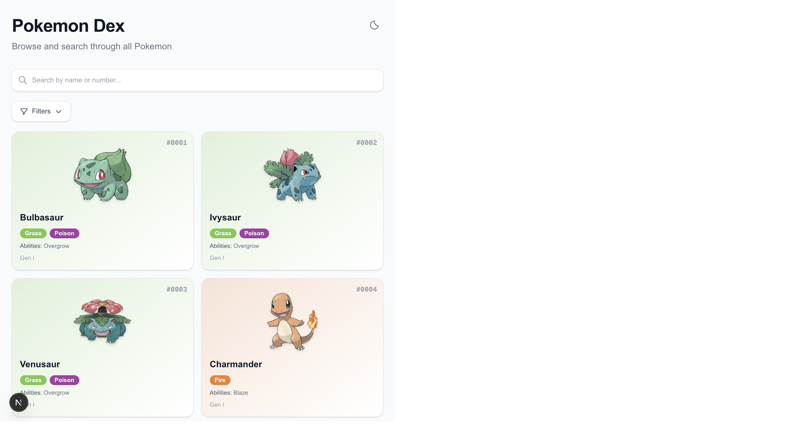
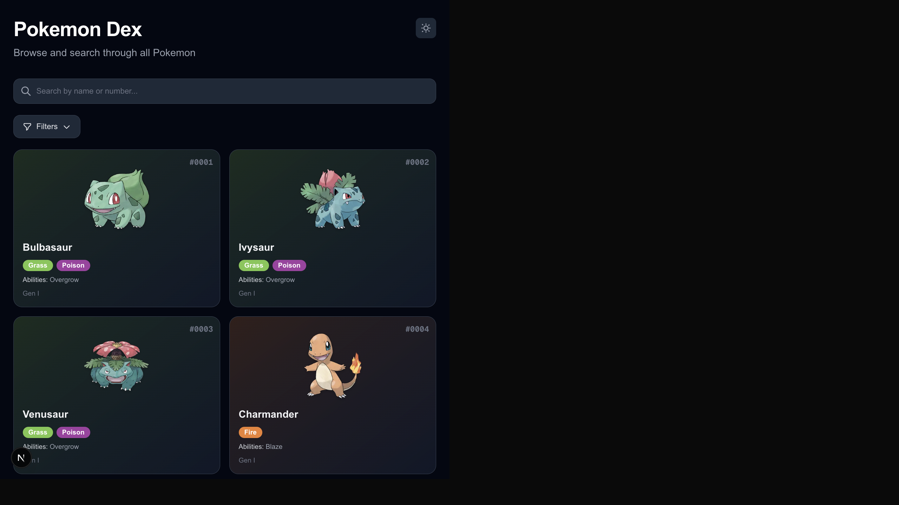
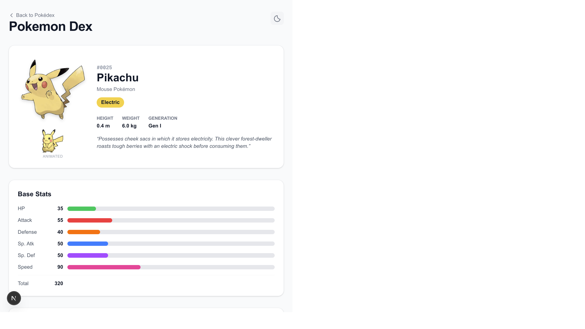
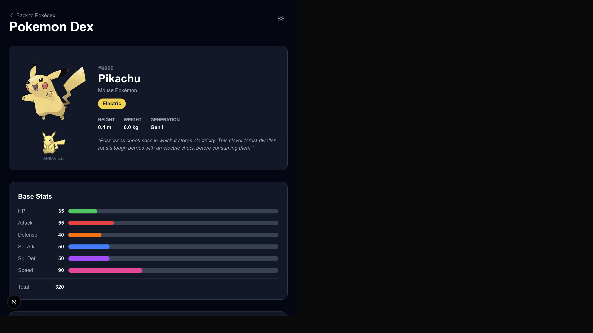

# Pokemon Dex

A modern, interactive Pokemon encyclopedia built with Next.js. Browse, search, and explore detailed information for all 1025 Pokemon.


## Screenshots

### Home Page
| Light Mode | Dark Mode |
|:---:|:---:|
|  |  |

### Detail Page
| Light Mode | Dark Mode |
|:---:|:---:|
|  |  |

## Features

- **Pokemon Card Grid** — Browse all 1025 Pokemon in a responsive card layout with official artwork, type badges, abilities, and generation info
- **Search & Filter** — Instant client-side search by name or Pokedex number, filter by type (multi-select) and generation, with active filter chips
- **Infinite Scroll** — Fast initial load (~40 Pokemon server-side), then seamless infinite scroll for the rest
- **Detail Pages** — Full Pokemon detail at `/pokemon/[id]` with base stats, evolution chain, abilities, encounter locations, and flavor text
- **3D Tilt Effect** — Interactive hero image with perspective tilt, holographic shine overlay, and animated Showdown sprites
- **Image Zoom Modal** — Click-to-zoom dialog with front/back sprite toggle, scroll/pinch zoom (1x–4x), and pan
- **Dark Mode** — Light/dark theme toggle with system preference detection and persistence via `next-themes`
- **Smooth Animations** — Fade+scale card entrance, staggered loading, animated filter chips
- **Navigation Cache** — Preserves scroll position, loaded data, and filter state across back/forward navigation

## Tech Stack

- **Framework:** [Next.js 16](https://nextjs.org/) (App Router, Server Components)
- **UI:** [React 19](https://react.dev/) + [Tailwind CSS 4](https://tailwindcss.com/)
- **Language:** TypeScript 5
- **Data Source:** [PokeAPI](https://pokeapi.co/) (free, no authentication required)
- **Theme:** [next-themes](https://github.com/pacocoursey/next-themes)

## Getting Started

```bash
# Install dependencies
npm install

# Run development server
npm run dev

# Build for production
npm run build

# Start production server
npm start
```

Open [http://localhost:3000](http://localhost:3000) to browse the Pokedex.

## Project Structure

```
app/
  page.tsx                 # Home page — server-fetched Pokemon grid
  layout.tsx               # Root layout with ThemeProvider
  pokemon/[id]/page.tsx    # Pokemon detail page (SSR)
components/
  PokemonCard.tsx          # Individual Pokemon card
  PokemonGrid.tsx          # Card grid with search, filter, infinite scroll
  SearchBar.tsx            # Debounced search input
  FilterPanel.tsx          # Type & generation filters
  ActiveFilterChips.tsx    # Dismissible filter chips
  SiteHeader.tsx           # Shared header with theme toggle
  StatBar.tsx              # Base stat horizontal bars
  EvolutionChain.tsx       # Visual evolution flow diagram
  AbilityList.tsx          # Ability descriptions
  EncounterList.tsx        # Encounter locations grouped by region
  TiltImage.tsx            # 3D perspective tilt effect
  ImageModal.tsx           # Zoom/pan dialog with front/back toggle
  HeroImage.tsx            # Detail page hero image wrapper
  AnimatedSprite.tsx       # Showdown animated GIF sprite
lib/
  pokemon.ts               # PokeAPI data fetching & types
  pokemon-cache.ts         # Client-side navigation cache
  type-colors.ts           # Type color mappings
  region-map.ts            # Game version to region mapping
```

## License

MIT
